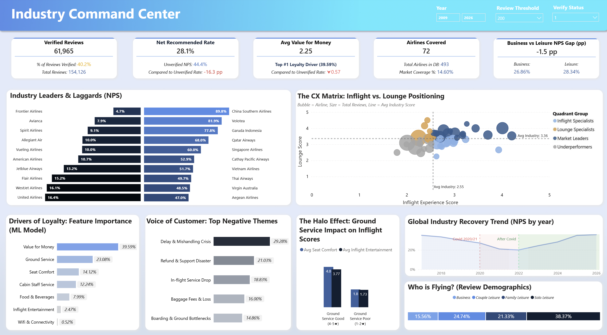
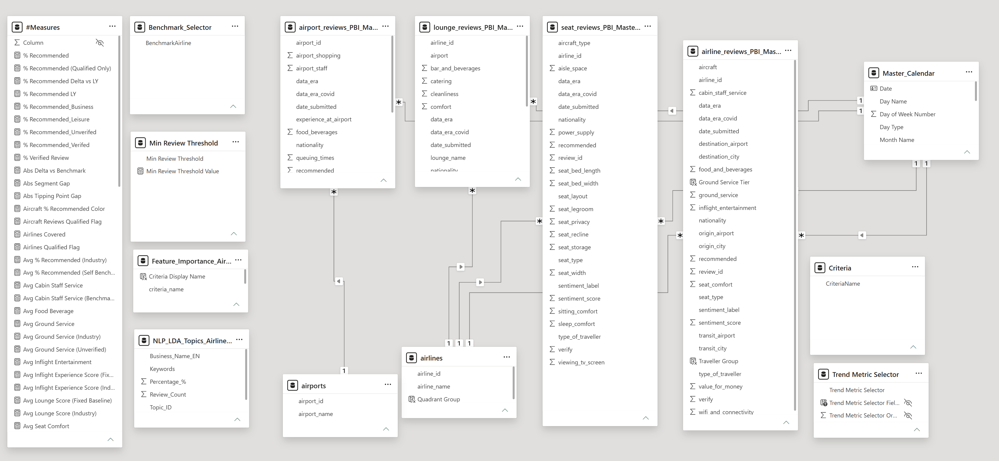
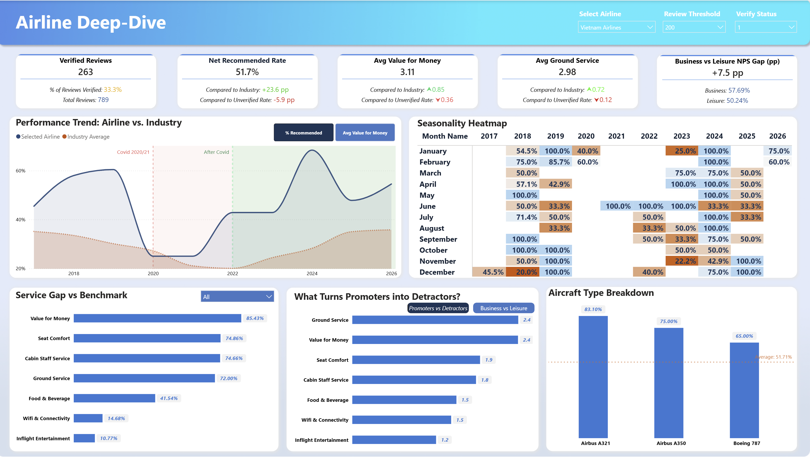

# # Airline Customer Experience (CX) Priority Analysis
> What Passengers Complain About vs What Actually Matters
> What airline passengers complain about and what actually decides whether they come back are two different lists.

   

---



---

## Key Takeaways

- **Wifi scores worst of every service attribute (1.96 / 5) and matters least — 0.52% of the model's explanation.** Ground service, scoring barely better at 2.27, is the leading service attribute at **23.08%**.
- **A bad ground experience drags every later score down with it.** Passengers who rated ground service 4–5★ gave seat comfort **4.01**; those who rated it 1–2★ gave the identical seats **1.77**.
- **The public ranking is inflated.** Unverified reviews recommend at 44.4% against 28.1% for verified ones — a **16.3-point** gap across 154,126 reviews.

---

## Business Context

Xóm Air is a customer-experience consultancy for the aviation industry. Its clients are airlines, airport groups and alliances who want to know what passengers actually think — not what satisfaction surveys tell them. To answer that, Xóm Air maintains a repository of **215,000 passenger-written reviews** scraped from independent review platforms, covering four parts of a journey: the flight, the airport, the lounge and the seat.

The commercial problem is that everyone in the industry reacts to whatever passengers shout about loudest. Wifi complaints are visible, quotable and easy to put on a slide, so wifi gets budget. Nobody had tested whether the loudest complaint is the one that changes behaviour. Meanwhile, client airlines were benchmarking themselves against public review scores without knowing that roughly 60% of those scores come from reviews with no proof the flight ever happened.

This analysis covers the flight leg — **154,126 airline reviews across 493 carriers, 2009 to 2026**.

---

## Business Questions

1. Which service attributes are genuinely associated with a passenger's decision to recommend — and which only _appear_ to matter?
2. What do passengers complain about most, and does that overlap with what drives loyalty?
3. Which airlines lead and which lag, on which specific criteria?
4. Has the industry recovered from Covid, and did passenger priorities shift?
5. Do business and leisure travellers behave differently?
6. How far apart are verified and unverified reviews — and what does that say about the reliability of public rankings?

---

## Dataset Overview

|Attribute|Detail|
|---|---|
|**Source**|Public dataset — [Xóm Data / Skytrax](https://dataset.xomdata.com/datasets/schema/skytrax)|
|**Period**|January 2009 – June 2026|
|**Records**|154,126 airline reviews · 493 carriers|
|**Verified**|61,965 (40.2%)|
|**Tables**|6 total — 4 independent review tables plus 2 shared dimensions|
|**Scale**|Every service attribute rated 1–5, higher is better|

Four review tables cover airlines, airports, lounges and seats. They share no passenger key — the only join paths are `airline_id` and `airport_id`. **This analysis covers `airline_reviews` in depth**; the other three were cleaned and profiled but not analysed.

> **Missing values carry meaning here.** Passengers rate only the attributes they cared about, so a blank is not a zero. Wifi is blank in **73.3%** of reviews; value for money in **0.2%**. That difference is itself a finding — see Finding 1.

Field definitions, known defects and derived measures: [`data/data_dictionary.md`](data/data_dictionary.md)

---

## Analysis Approach

```
Raw CSV (6 tables)
   → Python cleaning + VADER sentiment + LDA topic modelling
   → BigQuery exploration (23 queries, 4 themes)
   → Random forest on verified reviews
   → Power BI model (2 pages)
```

Three decisions shaped everything downstream:

- **Verified reviews only, for every statistical claim.** Unverified reviews recommend 16.3 points higher (Finding 3). Mixing them would have inflated every number in this report.
- **A minimum review threshold, enforced in both SQL and Power BI.** `HAVING COUNT(*) >= 350` in the queries, a user-adjustable parameter on the dashboard. Without it, a carrier with nine glowing reviews outranks Singapore Airlines.
- **Cross-check every headline number.** Each figure below was recomputed independently from the source file; the dashboard and the recomputation agree to the decimal.

---

## Key Findings

### Finding 1 — The loudest complaint is the least important one

|Attribute|Avg score (verified)|% who bothered to rate it|Model importance|
|---|---|---|---|
|**Wifi & connectivity**|**1.96** ← worst|**37.3%** ← lowest|**0.52%** ← last|
|Value for money|2.25|100.0%|39.59%|
|**Ground service**|**2.27**|95.9%|**23.08%** ← top service attribute|
|Inflight entertainment|2.45|54.0%|2.47%|
|Food & beverages|2.49|68.2%|7.99%|
|Seat comfort|2.51|92.1%|14.12%|
|Cabin staff service|2.76|91.5%|12.24%|

Wifi is the worst-rated attribute in the industry. It is also the one passengers least often bother to rate, and the one a random forest finds almost useless for separating passengers who recommend from those who don't. Ground service scores barely better — 2.27 against 1.96 — yet accounts for **44 times more** of the model's explanation.

Value for money tops the table, but it is not an actionable finding: it is a summary verdict passengers reach after weighing everything else, not a service an airline delivers. Excluding it and re-running the model is what the check below tests — and ground service leads the service attributes either way.

The three columns together tell a coherent story. Passengers who don't care about wifi skip the question; those who do care rate it badly; and neither group lets it decide whether they fly the airline again. A complaint can be loud, frequent and genuine while still being commercially irrelevant.

<details> <summary><b>Robustness check — does the ranking survive removing value for money?</b></summary>

`value_for_money` is not a service attribute. It is a summary verdict a passenger reaches _after_ weighing everything, which puts it close to the target variable itself. Three tests confirm it:

|Test|Result|
|---|---|
|Correlation with `recommended`|**+0.842** — the highest of any attribute|
|Predicting with that single feature alone|**94.7%** accuracy, against **94.9%** for all six service attributes combined|
|Adding it to the six-feature model|Accuracy rises only **1.1 points** (94.9% → 96.0%) while it claims **39.59%** of the importance|

One feature does the work of six, adds almost no information, and absorbs 40% of the attribution — the known behaviour of impurity-based importance when features are correlated.

Re-running the model without it tests whether the conclusion depends on that choice:

|Attribute|With value for money|Without|
|---|---|---|
|Ground service|23.08% →|**36.63%**|
|Seat comfort|14.12% →|24.81%|
|Cabin staff service|12.24% →|18.42%|
|Food & beverages|7.99% →|14.17%|
|Inflight entertainment|2.47% →|4.88%|
|Wifi & connectivity|0.52% →|1.07%|

**No attribute changed rank**, and the 39.59% redistributed almost exactly in proportion — it was not standing in for any single attribute. The conclusion holds under both specifications.

</details>

---

### Finding 2 — Ground service colours every score that follows it

|Ground service rating|n|Seat comfort given|Inflight entertainment given|Recommend rate|
|---|---|---|---|---|
|4–5★|16,451|**4.01**|3.77|**85.3%**|
|1–2★|37,568|**1.77**|1.73|**3.4%**|

The seats are the same seats. The entertainment system is the same system. What changes is a passenger's mood by the time they reach them — a **2.24-point swing on a 5-point scale**, and a recommend rate of 85.3% against 3.4%.

This reframes Finding 1. Ground service may top the importance ranking partly _because_ it contaminates every other rating, not purely on its own merits. That distinction matters for how the result should be read — but it strengthens the business case rather than weakening it. If the ground experience sets the frame for everything a passenger evaluates afterwards, investment there pays out across the whole journey rather than in one line item.

Three explanations fit the data and this analysis cannot separate them: a genuine halo effect, correlated operational quality, or mood-driven rating behaviour. See [Limitations](https://claude.ai/chat/85293696-fc37-431e-b70c-6e53e4431b13#limitations).

---

### Finding 3 — The public ranking is inflated by 16 points

|Review type|Count|Share|Recommend rate|
|---|---|---|---|
|Verified — flight evidence provided|61,965|40.2%|**28.1%**|
|Unverified|92,161|59.8%|**44.4%**|
|**Gap**|||**−16.3 pp**|

Six out of ten reviews in the industry's most-cited dataset carry no proof the flight took place, and those reviews are systematically more positive. Any ranking built on the full pool sits roughly sixteen points above what verified passengers actually report.

The practical consequence is that airlines are benchmarking against an inflated baseline. An airline improving from 28% to 32% verified recommendation may still look like it is underperforming a "market average" that is itself an artefact of unverified enthusiasm.

Every statistical claim in this report uses verified reviews only. The dashboard keeps the toggle so the difference stays visible rather than hidden behind a methodology note.

---

### Finding 4 — Business travellers are harder to please, except where they aren't

||Business|Leisure|Gap|
|---|---|---|---|
|**Industry**|26.86% _(n = 9,640)_|28.34% _(n = 52,322)_|**−1.48 pp**|
|**Vietnam Airlines**|57.69%|50.24%|**+7.5 pp**|

Industry-wide, business travellers recommend slightly _less_ than leisure travellers despite paying more and sitting further forward. The plain reading is that expectation rises with price: the same cabin scores lower when someone paid more to sit in it.

Vietnam Airlines inverts this, and by a nine-point margin against the industry pattern. Its business cabin is not merely satisfying premium passengers, it is satisfying them _more_ than its leisure passengers — a profile shared by very few carriers in the dataset.

Read alongside the airline's other figures — recommendation **51.7%** against an industry 28.1%, value for money **3.11** against 2.25, ground service **2.98** against 2.27 — the pattern is of a carrier whose service delivery outruns its scale. At the dashboard's 200-review threshold it ranks seventh in the industry, ahead of Thai Airways and Virgin Australia — a placing its review volume alone would not suggest.

---

### Finding 5 — A third of the "industry average" is one nationality

|Reviewer nationality|Verified reviews|Recommend rate|
|---|---|---|
|**United States**|**22,367**|**15.28%**|
|Canada|5,204|22.52%|
|United Arab Emirates|827|28.17%|
|India|2,038|30.37%|
|Australia|4,530|35.50%|
|United Kingdom|6,865|36.58%|
|Germany|1,887|38.63%|
|France|1,001|44.76%|

American reviewers write **36.2%** of all verified reviews and recommend at less than half the rate of everyone else — 15.28% against 35.36%, a raw gap of **20.1 points**.

Raw gaps like this usually mean one of two things: American passengers fly worse airlines, or American passengers are harder to please. Comparing how the two groups rate _the same carrier_ separates them:

|Airline|US reviewers|Other reviewers|Gap|
|---|---|---|---|
|Norwegian|13.9%|42.5%|−28.6 pp|
|Lufthansa|14.8%|33.6%|−18.9 pp|
|British Airways|19.8%|36.7%|−16.9 pp|
|United Airlines|13.4%|30.3%|−16.9 pp|
|Delta Air Lines|21.0%|36.9%|−15.9 pp|
|Air Canada|8.6%|21.7%|−13.1 pp|
|American Airlines|9.3%|21.6%|−12.3 pp|
|Turkish Airlines|15.4%|25.5%|−10.1 pp|
|**Average across carriers**|||**−16.7 pp**|

Holding the airline constant, the gap narrows only from 20.1 to 16.7 points. **Roughly five-sixths of the difference is the reviewer, not the airline** — and it holds for European and Canadian carriers too, so it is not a case of Americans disliking American airlines.

This is a caveat on every other number in this report, including the ones above. The industry recommendation rate of 28.1% is a weighted average in which one nationality holds a third of the weight and rates two standard deviations below the rest. Any airline whose passenger base skews American will appear to underperform for reasons that have nothing to do with its service.

---

## Business Recommendations

### 1. Move wifi spend to ground operations

**Based on:** Findings 1 and 2 Wifi accounts for 1.07% of the recommendation decision; ground service accounts for 36.63% and additionally lifts how passengers score everything downstream. Wifi is worth fixing when it is broken, but it does not belong in a loyalty budget. 

**Expected outcome:** ground service is the only attribute with both a low score (2.27) and top-ranked importance — the largest available gap between current state and impact. 

**Owner:** VP Customer Experience, with Ground Operations

### 2. Benchmark against verified reviews only, and republish the baseline

**Based on:** Finding 3 Rebuild internal CX targets from the 40.2% of reviews carrying flight evidence. Publish the verified baseline alongside the public number so the sixteen-point difference is visible to everyone using it. 

**Expected outcome:** removes a systematic 16.3-point distortion from every competitive comparison the CX team makes. 

**Owner:** Chief Insights Officer

### 3. Weight the industry benchmark by reviewer nationality

**Based on:** Finding 5 The industry average is 36.2% American and Americans rate 16.7 points below everyone else on identical carriers. Any airline comparing itself to that average should compare against a nationality-adjusted figure, or against carriers with a similar passenger mix. 

**Expected outcome:** stops carriers with US-heavy passenger bases from being penalised for their reviewer profile rather than their service. 

**Owner:** Chief Insights Officer, with the analytics team

### 4. For Vietnam Airlines: defend the premium cabin, close the leisure gap

**Based on:** Finding 4 The airline's business-cabin advantage (+7.5 pp against an industry −1.48 pp) is unusual enough to be a competitive asset worth protecting. The leisure segment, at 50.24%, is where the remaining headroom sits — and it is the larger group. 

**Expected outcome:** the airline already sits 23.6 points above the industry recommendation rate; the leisure gap is the one segment still tracking below its own average. 

**Owner:** VP Customer Experience

---

## Data Cleaning & Preparation

|Issue|Treatment|Rationale|
|---|---|---|
|Free-text review bodies, no structured sentiment|VADER sentiment scoring, then LDA topic modelling to group recurring complaints into themes|Turns 154,126 unstructured comments into a rankable list of complaint themes without manual coding|
|Reviews before 2009 too sparse to be meaningful|Dropped|A few dozen reviews per year cannot support a trend line, and their presence stretched every time axis pointlessly|
|Verified and unverified reviews behave differently|Kept both, flagged explicitly, defaulted every analysis to verified|Deleting 59.8% of the data hides the problem; the gap is itself a finding|
|Small carriers dominating rankings on a handful of reviews|Minimum-review threshold, adjustable by the user|A fixed cutoff embeds a judgement in the data; a parameter lets the reader test their own|
|`airline_id = 419` labelled **"Read more"** — 6,700 reviews, 4.3%|Excluded from carrier-level analysis|A scraping artefact: link text captured as an airline name. It is the second-largest "carrier" in the dataset|
|Blanks in service scores|Left as null, never imputed as zero|A blank means "did not rate", not "rated badly". Imputing zero would have made wifi look catastrophic instead of ignored|

**Result:** 154,126 rows, 26 columns, zero duplicates, all foreign keys resolving.

---

## Data Model



Star schema built on `airline_reviews_PBI_Master_Optimized_V4` as the fact table, with `Master_Calendar` supporting the year-over-year and seasonality measures. Sentiment label, sentiment score and the Covid-era flag were materialised in Python rather than computed in DAX, keeping the model light enough to stay responsive at 154k rows.

---

## Modeling Approach

|Aspect|Detail|
|---|---|
|**Problem**|Binary classification — does this passenger recommend the airline?|
|**Algorithm**|`RandomForestClassifier(n_estimators=100, max_depth=5, random_state=42)`|
|**Features**|6 service attributes (7 in the first specification)|
|**Population**|Verified reviews, 2009 onward, complete on all features|
|**Sample**|20,644 rows — **33.3% of verified reviews**|
|**Purpose**|Explanation, not prediction. No holdout split; no accuracy is claimed|
|**Robustness**|Re-run without `value_for_money`; rank order unchanged (see Finding 1)|

`max_depth=5` constrains each tree against overfitting; `random_state=42` makes the result reproducible. Importance is scikit-learn's default impurity-based measure — which distributes credit somewhat arbitrarily among correlated features, and measures association rather than causation. The language throughout this report reflects that.

---

## Technical Highlights

<details> <summary><b>The robustness check that made the headline defensible</b></summary>

```python
features = ['seat_comfort', 'cabin_staff_service', 'food_and_beverages',
            'inflight_entertainment', 'ground_service', 'wifi_and_connectivity']
# value_for_money deliberately excluded: it is a summary verdict, not a
# service attribute, and sits close to the target variable

df_ml = df[df.verify == 1][features + ['recommended']].dropna()
model = RandomForestClassifier(n_estimators=100, max_depth=5, random_state=42)
model.fit(df_ml[features], df_ml['recommended'])
```

Running the model both ways and comparing rank order turns "the model says ground service matters" into "the model says ground service matters regardless of how I specify it."

</details> <details> <summary><b>A statistical threshold enforced in two places</b></summary>

```sql
-- SQL: no carrier enters a ranking on fewer than 350 reviews
GROUP BY a.airline_name
HAVING COUNT(*) >= 350
```

```dax
Airlines Qualified Flag =
IF( [Total Reviews] >= [Review Threshold Value], 1, 0 )

% Recommended (Qualified Only) =
IF( [Airlines Qualified Flag] = 1, [% Recommended], BLANK() )
```

At the dashboard's default threshold of 200 reviews, 72 of 493 carriers qualify — **14.6% of airlines covering 77.6% of reviews**. Exposing the threshold as a parameter lets the reader see how the ranking moves as the bar rises.

</details> <details> <summary><b>Measures that rewrite their own labels</b></summary>

```dax
Delta % Cabin Staff Text =
VAR d = [Avg Cabin Staff] - [Avg Cabin Staff (Industry)]
RETURN
    IF( d >= 0,
        "▲ " & FORMAT( d, "0.00" ),
        "▼ " & FORMAT( ABS(d), "0.00" ) )
```

Eight text measures rewrite themselves as the user changes airline, so every comparison on the deep-dive page states its own direction rather than leaving the reader to work out the sign.

Full documentation: [`powerbi/dax_measures.md`](powerbi/dax_measures.md) — 91 measures in 8 groups.

</details>

---

## Dashboard Walkthrough

**Page 1 — Industry Command Center** · _Chief Insights Officer and market analysts_  Establishes the benchmark any single airline is measured against. Leads with the verified-review share so the reliability caveat is visible before any ranking is read, and pairs the loyalty-driver model with the complaint themes so the mismatch between them is unavoidable.

**Page 2 — Airline Deep-Dive** · _VP Customer Experience at a client airline_  Every figure is expressed as a delta against the industry rather than as a raw score, because a CX lead cannot act on "2.98" but can act on "+0.72 against the market". The verified toggle and review threshold remain available so the client can stress-test their own numbers.

---

## Repository Structure

```
airline-cx-priority-analysis/
├── data/
│   ├── raw/                 # Six source tables as published
│   ├── processed/           # Cleaned fact table used by Power BI
│   └── data_dictionary.md   # Field definitions, defects, derived measures
├── notebooks/               # Cleaning, sentiment, topic modelling, ML
├── sql/                     # 23 BigQuery queries across 4 themes
├── powerbi/                 # Data model, 91 DAX measures, PDF export
└── images/                  # Dashboard screenshots
```

---

## Challenges & Limitations

**Challenges**

- **Missing values that carry information.** Wifi is blank in 73.3% of reviews and value for money in 0.2%. Treating blanks as zeros would have made wifi the industry's catastrophe; treating the blank rate as a signal turned it into Finding 1. The distinction between "rated badly" and "not worth rating" is the whole of that finding.
- **A benchmark that flatters everyone in it.** The 16.3-point verified gap meant that any comparison drawn from the full review pool was systematically wrong. Every statistical claim had to be rebuilt on the 40.2% carrying flight evidence.
- **A ranking that rewarded obscurity.** Without a minimum-review rule, carriers with a handful of enthusiastic reviews outranked Singapore Airlines. Solved with a threshold enforced identically in SQL and DAX, and exposed as a user parameter rather than hard-coded.
- **A link label masquerading as an airline.** `airline_id = 419` carries the name "Read more" and 6,700 reviews — 4.3% of the dataset, and the second-largest "carrier" among US reviewers. A scraping artefact that would have entered every ranking unnoticed.

**Limitations**

- **The model sees a third of the verified data.** Requiring complete ratings across all six attributes leaves 20,644 of 61,965 reviews. Passengers who rate everything may be systematically more thorough — or more extreme — than those who rate selectively.
- **Feature importance is association, not causation.** The model identifies what separates recommenders from detractors, not what would happen if an airline improved a given attribute.
- **The halo effect has three possible explanations.** Genuine mood contamination, correlated operational quality, and rating-behaviour bias all fit the observed 2.24-point swing. This data cannot separate them.
- **National composition distorts every aggregate.** Finding 5 applies to Findings 1 through 4 as much as to the rankings.
- **One table of four.** Airport, lounge and seat reviews were cleaned and profiled but not analysed.
- **Ranking coverage is 14.6%.** At the default threshold, 72 of 493 carriers qualify — covering 77.6% of reviews, but leaving 421 carriers unranked.
- **The business context is illustrative.** The data is real; Xóm Air is a scenario built to give the analysis a stakeholder.

**Future Improvements**

- Replace impurity-based importance with permutation importance, which handles correlated features more honestly.
- Model missingness directly rather than dropping it — the decision to rate wifi may predict recommendation as strongly as the rating itself.
- Extend the analysis to airport, lounge and seat reviews, where 58,000 rows remain untouched.
- Build a nationality-adjusted industry benchmark so airlines can be compared on service rather than on reviewer mix.

---

## Author

**Lương Thế Kiện** Data Analyst — turning customer feedback into service investment decisions

[LinkedIn](https://www.linkedin.com/in/ltkien1706/) · [luongkienss68@gmail.com](mailto:luongkienss68@gmail.com)
